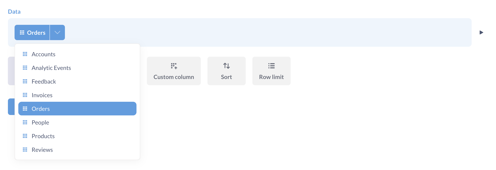

# Interactive embedding UI components

To change the interface of your interactive embed, you can add parameters to the end of your embedding URL. If you want to change the colors or fonts in your embed, see [Customizing appearance](../configuring-metabase/appearance.md).

For example, you can disable Metabase's [top nav bar](#top_nav) and [side nav menu](#side_nav) like this:

```
your_embedding_url?top_nav=false&side_nav=false
```


Here's an example using the URL constructor to add parameters to the URL for the iframe:

```tsx
const mods = "logo=false&top_nav=true&search=true&new_button=true";

app.get("/sso/metabase", restrict, (req, res) => {
    const ssoUrl = new URL("/auth/sso", METABASE_SITE_URL);
    ssoUrl.searchParams.set("jwt", signUserToken(req.session.user));
    ssoUrl.searchParams.set("return_to", `${req.query.return_to ?? "/"}?${mods}`);
  
    res.redirect(ssoUrl);
});
```

Parameters include:

- [Action buttons](#action_buttons)
- [Additional info](#additional_info)
- [Breadcrumbs](#breadcrumbs)
- [Entity types](#entity_types)
- [Header](#header)
- [Locale](#locale)
- [Logo](#logo)
- [New button](#new_button)
- [Search](#search)
- [Side nav](#side_nav)
- [Top nav](#top_nav)

> To make sure that query parameters are preserved when using [click behavior](../dashboards/interactive.md#customizing-click-behavior), configure the [Site URL](../configuring-metabase/settings.md#site-url) Admin setting to be your Metabase server URL.

## `action_buttons`

Visible by default on question pages when the [header](#header) is enabled.

To hide the action buttons such as **Filter**, **Summarize**, the query builder button, and so on:

```
header=false&action_buttons=false
```


## `additional_info`

Visible by default on question and dashboard pages, when the [header](#header) is enabled.

To hide the gray text "Edited X days ago by FirstName LastName", as well as the breadcrumbs with collection, database, and table names:

`header=false&additional_info=false`


## `breadcrumbs`

Shown by default in the top nav bar. Collection breadcrumbs show the path to the item (i.e., the collection(s) the item is in). To hide the breadcrumbs:

```
breadcrumbs=false
```

## `entity_types`



In the data picker, you can show or hide different entity types. For example, you may only want to show tables.

```
entity_types=table
```

Setting entity types also affects the sidebar. If only tables are allowed, the sidebar won't show models:


The new button dropdown (if `new_button=true`) will also exclude models:


Available entity types are:

- `table`
- `model`

You can separate entity types with a comma, like: 

```
entity_types=table,model
```

The default behavior for the data picker is to show all entity types.

## `header`

Visible by default on question and dashboard pages.

To hide a question or dashboard's title, [additional info](#additional_info), and [action buttons](#action_buttons):

`header=false`

## `locale`

You can change the language of the user interface via a parameter. For example, to set the locale to Spanish:

```
locale=es
```

Read more about [localization](../configuring-metabase/localization.md).

## `logo`

Whether to show the logo that opens and closes the sidebar nav. Default is true. How Metabase displays the logo depends on the `side_nav` setting. Here's a rough breakdown of how these two parameters interact:

If `logo=true` and:

- `side_nav=true`: Looks like regular Metabase (with whatever logo you have set).
- `side_nav=false`: There is no sidebar, so nothing happens when you hover over the logo.

If `logo=false` and:

- `side_nav=true`: Metabase shows the generic sidebar icon, with a gray color in normal state, and a brand color on hover.
- `side_nav=false`: There is no side nav nor logo, so the breadcrumbs move all the way to the left of the screen.

## `new_button`

Hidden by default. To show the **+ New** button used to create queries or dashboards:

```
top_nav=true&new_button=true
```

## `search`

Hidden by default. To show the search box in the top nav:

```
top_nav=true&search=true
```

## `side_nav`

The navigation sidebar is shown on `/collection` and home page routes, and hidden everywhere else by default.

To allow people to minimize the sidebar:

```
top_nav=true&side_nav=true
```


## `top_nav`

Shown by default. To hide the top navigation bar:

```
top_nav=false
```


`search`, `new_button`, and `breadcrumbs` all depend on `top_nav` being set to `true`. If these three children (`search`, `new_button`, and `breadcrumbs`) are all false, Metabase will hide the top nav bar. 